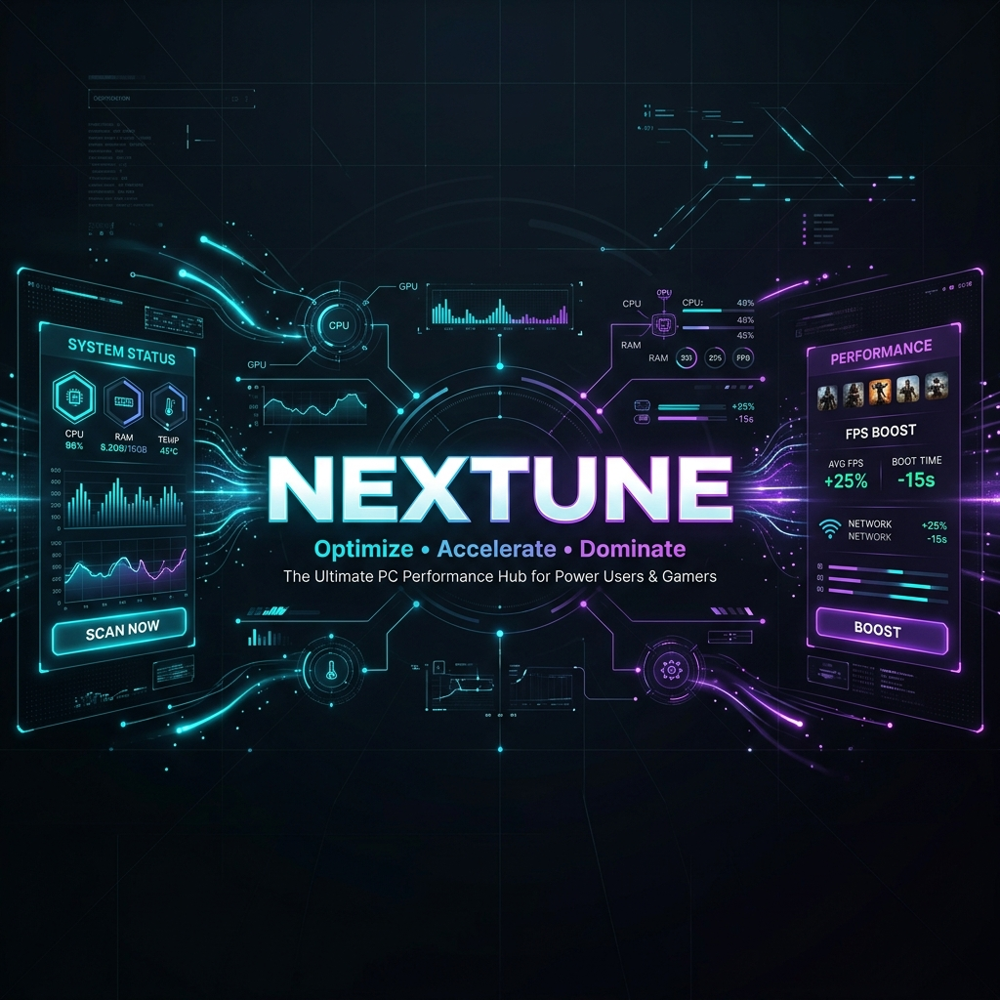

<div align="center">
  

  # NexTune: The Ultimate PC Optimizer
  
  **AI-Powered • Privacy-First • Rust-Backed Performance**
  
  [](https://tauri.app/)
  [](https://www.rust-lang.org/)
  [](LICENSE)
  
</div>

<br/>

## 🚀 For Everyone: Get Your PC in Flow State
Is your computer feeling sluggish? Do games stutter? Does Chrome eat all your RAM? 
NexTune is a next-generation Windows optimizer designed to instantly recover gigabytes of RAM, lower your CPU temperatures, and stop background bloatware dead in its tracks.

Unlike older optimizers that randomly kill processes and crash your apps, NexTune uses an **AI-Powered Smart Kill Engine** that *learns* how you use your PC. It protects your active windows, detects if you are listening to music, and safely puts unnecessary background tasks to sleep.

### 🌟 Key Features
- **Interactive Smart Scan:** Detects real-time bloatware wasting your system resources. You get full control with a checkbox UI to approve exactly what gets optimized.
- **Audio & Media Protection:** NexTune hooks into the Windows Core Audio APIs to ensure your background Spotify, Discord, or YouTube videos are never accidentally muted.
- **Browser Tree Shield:** Prevents browser tabs from crashing by intelligently grouping and protecting Google Chrome, Edge, and Brave process trees.
- **Deep Deep Clean:** Safely clears out gigabytes of junk files, temporary Windows logs, and browser caches with zero risk to your personal files.
- **Streamer Mode:** One-click ultimate performance for gamers and live-streamers.

---

## 📥 Download & Installation

The easiest way to get NexTune running on your PC is to download the pre-compiled Windows installer.

1. Go to the [Releases Page](https://github.com/anandX1/nextune/releases/latest) (or click on **Releases** on the right side of this page).
2. Download the latest **`NexTune_..._x64_en-US.msi`** file under the Assets section.
3. Double-click the downloaded `.msi` file to launch the setup wizard.
4. Follow the prompts to install NexTune.

> **Note:** Since NexTune is a powerful optimization tool that modifies system processes, Windows SmartScreen may show a warning on the first run. You can safely click "More info" -> "Run anyway".

---

## 💻 For Developers: The Technical Architecture
NexTune is built for maximum speed and minimal overhead.

### Tech Stack
* **Backend:** Rust 🦀
* **Frontend:** Vanilla HTML, CSS, JavaScript (Zero bloat frameworks)
* **Framework:** Tauri v2
* **Database:** SQLite (Local AI Journaling)

### The "Smart Kill" Engine
At the core of NexTune is a sophisticated rust-native system monitoring engine that utilizes `windows-sys` and the `windows` crates to interface directly with the Windows API:
1. **COM Audio Detection:** Utilizes `IAudioSessionManager2` to identify any background process currently outputting audio via the Windows mixer.
2. **Heuristic Grouping:** It maps parent-child process relationships to prevent cascading failures (e.g., closing a Chromium helper thread).
3. **Behavioral Journaling:** A local SQLite database logs foreground window activity (`GetForegroundWindow`), allowing NexTune to build a local, privacy-respecting "Trust Score" for your applications.

### 🛠️ Building from Source
If you want to contribute or build your own version of NexTune, it's incredibly simple!

**Prerequisites:**
- [Node.js](https://nodejs.org/)
- [Rust](https://www.rust-lang.org/tools/install)
- [Visual Studio Build Tools](https://visualstudio.microsoft.com/visual-cpp-build-tools/) (C++ Desktop Development)

```bash
# Clone the repository
git clone https://github.com/anandX1/nextune.git
cd nextune

# Install frontend dependencies
npm install

# Run in development mode
npm run tauri dev

# Build the release installer (.msi / .exe)
npm run tauri build
```

## 🤝 Contributing
We welcome all contributions! Whether you're adding new apps to the `bloat-database.json`, optimizing the Rust backend, or creating new UI themes, feel free to open a Pull Request.

## 📝 License
NexTune is open-source software licensed under the MIT License.
